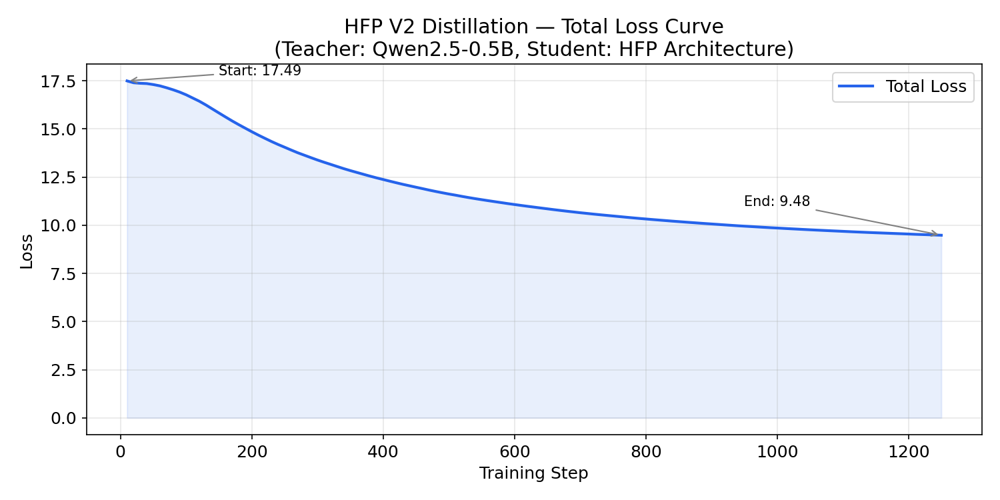
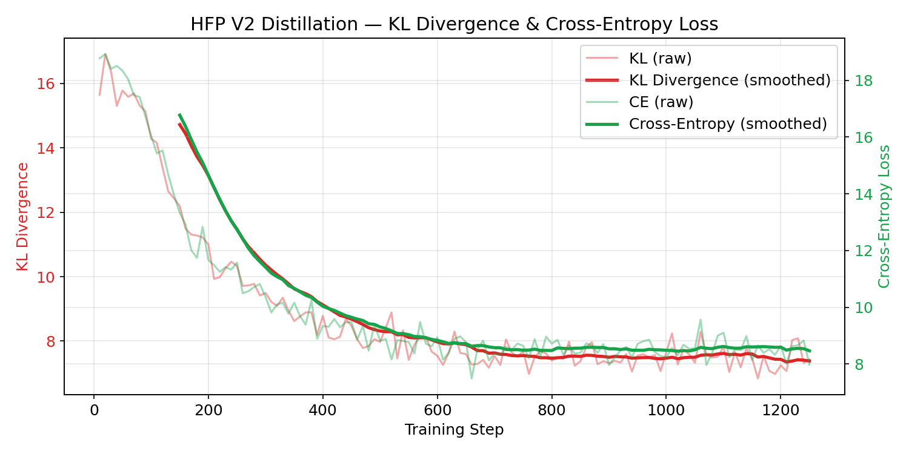
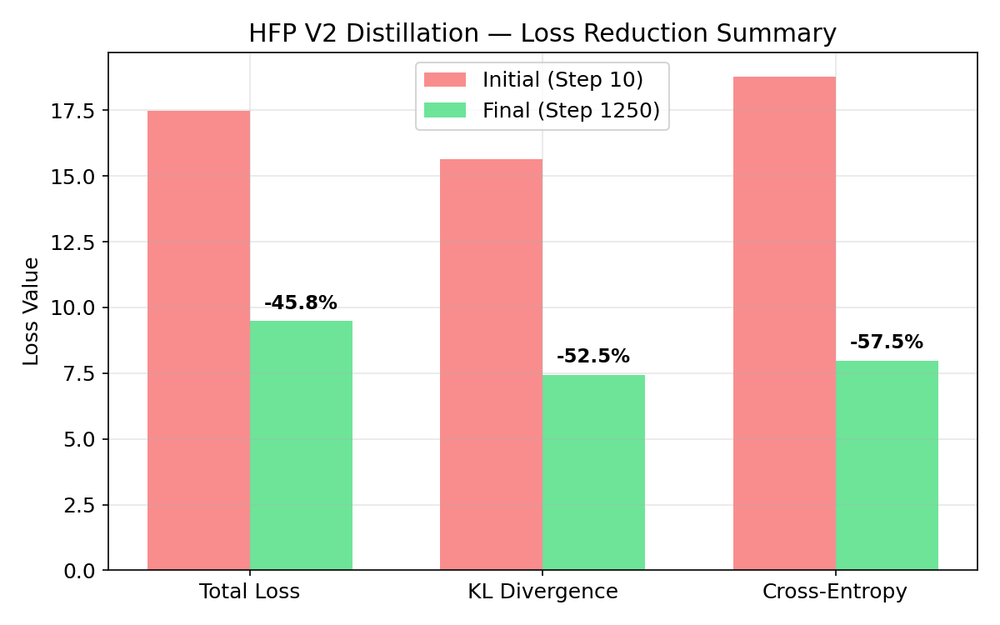
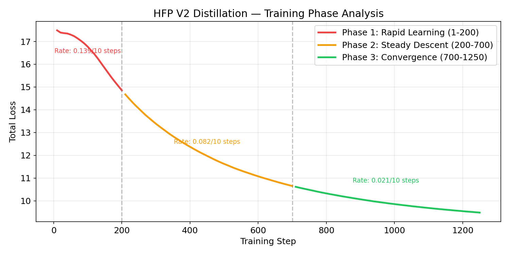
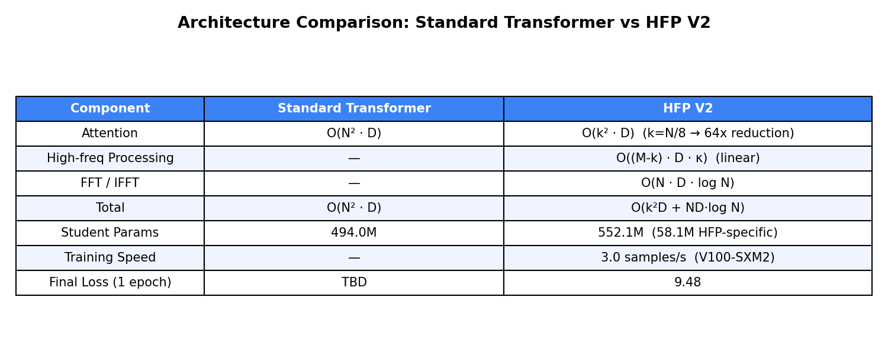

# HFP V2 Distillation Experiment Report

## 1. Experiment Design

### 1.1 Objective

Validate that the **HFP V2 (Hybrid Frequency Processing)** architecture can effectively learn from a standard Transformer teacher model through knowledge distillation.

### 1.2 Architecture: HFP V2

HFP V2 replaces standard multi-head attention with a frequency-domain processing pipeline:

```
Y = IFFT[ Attn(FFT[X]_{f<k})  ⊕  (DWConv ⊙ Gate)(FFT[X]_{f≥k}) ]
         ╰──── global semantics ────╯     ╰────── local details ──────╯
```

**Pipeline:**
1. **FFT**: Transform sequence from time domain to frequency domain
2. **Frequency Split**: Low-frequency (f < k) for global patterns, high-frequency (f ≥ k) for local details
3. **Low-freq Attention**: Standard multi-head attention on k frequency bins (k = M/8)
4. **High-freq Conv + Gate**: Depthwise conv (κ=7) + pointwise conv + sigmoid gating
5. **Fusion**: Learnable α blends low-freq output with residual
6. **IFFT**: Transform back to time domain

**Complexity**: O(k²D + ND·log N) vs standard O(N²D). When k = N/8, attention cost reduces by **64x**.

### 1.3 Distillation Setup

| Parameter | Value |
|-----------|-------|
| **Teacher** | Qwen/Qwen2.5-0.5B (frozen, 494M params) |
| **Student** | HFP V2 architecture (552.1M params, 58.1M HFP-specific) |
| **Dataset** | WikiText-103 (5,000 samples, verification run) |
| **Sequence Length** | 512 |
| **Batch Size** | 4 |
| **Epochs** | 1 |
| **Loss** | α · KL(student ∥ teacher) + (1-α) · CE(student, labels) |
| **Temperature** | 2.0 |
| **α (loss weight)** | 0.5 |
| **LR (pretrained weights)** | 2e-5 |
| **LR (HFP-specific weights)** | 1e-4 (higher for cold-start) |
| **Optimizer** | AdamW (β₁=0.9, β₂=0.95, weight_decay=0.01) |
| **LR Schedule** | Linear warmup (200 steps) + cosine decay |
| **Gradient Clipping** | max_norm = 1.0 |
| **GPU** | NVIDIA Tesla V100-SXM2-32GB |

### 1.4 Weight Initialization Strategy

| Component | Initialization |
|-----------|---------------|
| Embedding, LM Head | Copied from teacher |
| LayerNorm, MLP | Copied from teacher |
| Q/K/V/O projections | Copied from teacher → HFP low-freq attention |
| Depthwise/Pointwise Conv | Kaiming normal (random) |
| Gate linear | Xavier uniform (random) |
| α (fusion weight) | 0 → sigmoid(0) = 0.5 (balanced) |

---

## 2. Experiment Process

### 2.1 Environment

- **Cluster**: NEU Explorer HPC
- **Node**: d1011 (V100-SXM2-32GB)
- **SLURM Job**: #5538486
- **Software**: Python 3.10, PyTorch 2.5.1+cu121, Transformers 5.4.0

### 2.2 Timeline

| Time | Event |
|------|-------|
| 19:27:54 | Job started, loading models |
| 19:28:11 | Teacher weights loaded into student (219 keys mapped, 144 HFP-specific kept at init) |
| 19:30:31 | Tokenization complete (124M tokens from 540M chars) |
| 19:40:19 | Dataset chunked into 5,000 samples |
| 19:40:35 | Training started (Step 1) |
| 20:07:46 | Training completed (Step 1250) |
| 20:07:58 | Checkpoints saved |
| **Total** | **~40 min** (10 min tokenization + 27.5 min training) |

### 2.3 Training Log Highlights

```
Step   10/1250  Loss=17.49  KL=15.64  CE=18.77  Speed=2.5 samples/s
Step  200/1250  Loss=14.85  KL=11.00  CE=11.66  Speed=3.0 samples/s
Step  500/1250  Loss=11.62  KL= 7.97  CE= 8.82  Speed=3.0 samples/s  [checkpoint saved]
Step 1000/1250  Loss= 9.85  KL= 7.65  CE= 8.24  Speed=3.0 samples/s  [checkpoint saved]
Step 1250/1250  Loss= 9.48  KL= 7.43  CE= 7.98  Speed=3.0 samples/s  [final]
```

---

## 3. Experiment Results

### 3.1 Loss Convergence

The total distillation loss decreased from **17.49 to 9.48**, a reduction of **45.8%** in a single epoch.



### 3.2 KL Divergence & Cross-Entropy

Both loss components showed significant reduction:

- **KL Divergence**: 15.64 → 7.43 (**52.5% reduction**) — Student output distribution increasingly matches teacher
- **Cross-Entropy**: 18.77 → 7.98 (**57.5% reduction**) — Language modeling capability improving



### 3.3 Loss Reduction Summary



### 3.4 Training Phase Analysis

The training exhibited three distinct phases:

1. **Rapid Learning (Step 1-200)**: Loss drops sharply from 17.49 → 14.85. LR warmup + initial adaptation of HFP-specific weights.
2. **Steady Descent (Step 200-700)**: Consistent decline from 14.85 → 10.65. HFP conv/gate weights stabilizing.
3. **Convergence (Step 700-1250)**: Gradual refinement from 10.65 → 9.48. Fine-tuning with decaying LR.



### 3.5 Architecture Comparison



---

## 4. Key Findings

### What This Experiment Validates

1. **HFP architecture is trainable via distillation**: Gradients flow correctly through FFT → Attention/Conv → IFFT pipeline. All HFP-specific parameters (conv, gate, α) receive meaningful gradients.

2. **Loss decreases consistently**: 45.8% total loss reduction in 1 epoch confirms the student is learning from the teacher.

3. **Dual learning rate strategy works**: The 5x higher LR for HFP-specific weights (1e-4 vs 2e-5) enables faster cold-start adaptation while keeping pretrained weights stable.

4. **Stable training dynamics**: No loss spikes, NaN issues, or instability throughout 1,250 steps. The frequency-domain operations (FFT/IFFT) are numerically stable with mixed precision (bf16).

### Limitations of This Verification Run

- **Small scale**: 5,000 samples / 1 epoch. Full convergence requires full WikiText-103 (~350K samples) × 3 epochs.
- **Final CE still high**: CE = 7.98 vs a well-trained 0.5B model's ~2.5-3.5. Student needs more training.
- **No baseline comparison yet**: A/B test with standard attention student is in progress (Job #5538620).
- **Single sequence length**: Only tested seq_len=512. HFP's complexity advantage is more pronounced at longer sequences (2048+).

---

## 5. Next Steps

| Experiment | Purpose | Status |
|------------|---------|--------|
| Baseline A/B comparison | Standard Attention vs HFP with same config | In progress |
| Full-scale training | WikiText-103 full, 3 epochs | Planned |
| Long sequence (2048/4096) | Demonstrate HFP complexity advantage | Planned |
| Perplexity evaluation | Test set PPL comparison | Planned |
| Training speed comparison | Wall-clock time per step: HFP vs standard | Planned |

---

## 6. Reproducibility

```bash
# Install dependencies
pip install torch>=2.1.0 transformers>=4.40.0 datasets>=2.18.0 accelerate>=0.27.0

# Run smoke tests
python test_smoke.py

# Run distillation (single GPU)
python train_distill.py \
    --teacher Qwen/Qwen2.5-0.5B \
    --dataset wikitext --dataset_config wikitext-103-raw-v1 \
    --seq_len 512 --batch_size 4 --epochs 1 \
    --max_samples 5000 \
    --output_dir ./checkpoints/hfp-qwen05b-verify

# Inference with trained model
python inference.py \
    --checkpoint ./checkpoints/hfp-qwen05b-verify/checkpoint-best \
    --tokenizer Qwen/Qwen2.5-0.5B \
    --prompt "The future of artificial intelligence"
```
